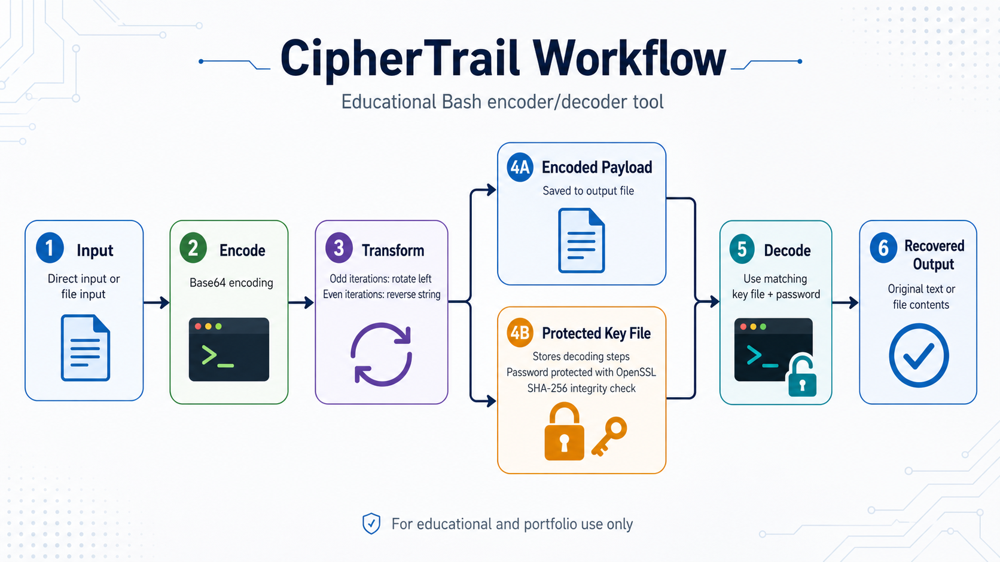
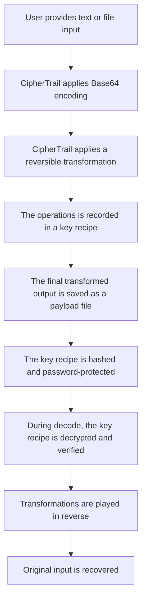

# CipherTrail

CipherTrail is an educational command-line encoding and transformation lab written in Bash. It demonstrates layered Base64 encoding, reversible string transformations, protected key-file handling, and integrity checking while clearly showing the difference between encoding, obfuscation, and real encryption.

## Important Security Notice

CipherTrail is an educational security tool, not production encryption software. The payload output is obfuscated through reversible transformations, while the key recipe is password-protected. Do not use this project to protect real secrets, credentials, financial data, personal data, or production files.

## What This Project Teaches

CipherTrail is designed to demonstrate several cybersecurity and scripting concepts:

- The difference between encoding, obfuscation, and encryption
- How reversible transformations can be layered
- How a transformation recipe can be stored separately from a payload
- How password-protected metadata can support a decode workflow
- How SHA-256 integrity checking can detect key recipe modification
- How Bash scripts can handle input validation, file output, and CLI arguments
- Why custom cryptographic systems should not be treated as a secure encryption

## Workflow Diagram



## Purpose

This project was created as a cybersecurity learning project to practice Bash scripting, command-line tool design, file handling, input validation, encoding/decoding workflow, OpenSSL usage, password-protected key files, and SHA-256 integrity checking.

CipherTrail is not intended to replace modern encryption tools or production-grade cryptographic software. Instead, it is a portfolio project meant to demonstrate scripting ability, security awareness, and understanding of how encoding, transformation logic, password protection, and integrity verification can work together in a command-line workflow.

## Features

- Interactive encode and decode workflow
- Command-line encode and decode support
- Layered Base64 encoding
- Reversible string rotation and string reversal
- Password-protected key file using OpenSSL
- SHA-256 integrity check for decrypted key instructions
- Direct text input or file-based input
- Auto-generated payload and key files
- `--help` usage menu
- `--version` output
- `explain` mode for educational descriptions
- `--self-test` mode for built-in verification
- `--verbose`, `--trace`, and `--quiet` output modes

## How It Works

During encoding, CipherTrail repeatedly applies Base64 encoding to the input. On odd-numbered iterations, it also applies a randomized left rotation. On even-numbered iterations, it reverses the string. The tool records each transformation step in a key file.

The key file is then protected with a user-created password. During decoding, CipherTrail decrypts the protected key file, verifies its SHA-256 hash, reads the stored transformation steps, and reverses the operations in the correct order to recover the original input.

At a high level, CipherTrail works like this:



## Requirements

CipherTrail requires the following tools:

- Bash
- OpenSSL
- Base64
- sha256sum or shasum

On macOS, `shasum` is usually available by default. On many Linux systems, `sha256sum` is usually available by default.

## Installation

Clone the repository:

```bash
git clone https://github.com/Soulrider750/ciphertrail.git
cd ciphertrail
```

Make the script executable:

```bash
chmod +x ciphertrail.sh
```

## Usage

CipherTrail can be used in two ways:

1. Interactive mode
2. Command-line mode

### Interactive Mode

Run the script without arguments:

```bash
./ciphertrail.sh
```

### Command-line Mode

Run CipherTrail with an explicit command:

```bash
./ciphertrail.sh encode [options]
./ciphertrail.sh decode [options]
```
View all available options:

```bash
./ciphertrail.sh --help
```

Check the installed version:

```bash
./ciphertrail.sh --version
```
### Explain Mode

CipherTrail includes an educational explanation mode:

```bash
./ciphertrail.sh explain
```
This mode explains:
- Base64 encoding
- String rotation
- String reversal
- Protected key files
- SHA-256 integrity checking
- Why CipherTrail is not production encryption

### Output Modes

CipherTrail supports different output levels:

| Option | Purpose|
|----|----|
| `--quiet` | Suppresses normal output. Useful for tests and automation. |
| `--verbose` | Shows high-level process messages. |
| `--trace` | Shows detailed transformation steps for educational walkthroughs. |

Eaxample:

```bash
./ciphertrail.sh encode \
  --input examples/sample_input.txt \
  --iterations 3 \
  --max-rotation 5 \
  -trace
  ```

### Self-Test

CipherTrail includes a built-in self-test that performs an encode/decode round trip and verifies that the decoded output matches the original input.

Run:

```bash
./ciphertrail.sh --self-test
```
Expected Result:

```bash
Running CipherTrail self-test...
Self-test passed.
```

## Encoding Examples

### Encode a File

```bash
./ciphertrail.sh encode \
  --input examples/sample_input.txt \
  --iterations 5 \
  --max-rotation 8 \
  --verbose
```

### Encode Direct Text

```bash
./ciphertrail.sh encode \
  --text "This is a CipherTrail test message." \
  --iterations 3 \
  --max-rotation 5
```

### Encode With Explicit Output Files

```bash
./ciphertrail.sh encode \
  --input examples/sample_input.txt \
  --output encoder_results/demo_payload.txt \
  --key encoder_results/demo_key.txt \
  --iterations 5 \
  --max-rotation 8
  ```

## Decoding Examples

### Decode a Payload File

```bash
./ciphertrail.sh decode \
  --input encoder_results/demo_payload.txt \
  --key encoder_results/demo_key.txt \
  --output encoder_results/demo_decoded.txt
  ```

### Decode and Display Output in the Terminal

```bash
./ciphertrail.sh decode \
  --input encoder_results/demo_payload.txt \
  --key encoder_results/demo_key.txt \
  --output encoder_results/demo_decoded.txt \
  --show
  ```

## Password Environment Variable Support

For testing and automation, CipherTrail can read the key-file password from an environment variable.

```bash
export CIPHERTRAIL_PASSWORD="StrongTestPassword123!"

./ciphertrail.sh encode \
  --input examples/sample_input.txt \
  --iterations 3 \
  --max-rotation 5 \
  --pasword-env CIPHERTRAIL_PASSWORD

./ciphertrail.sh decode \
  --input encoder_results/demo_payload.txt \
  --key encoder_results/demo_key.txt \
  --pasword-env CIPHERTRAIL_PASSWORD
```

## Example File

A sample input file is included in the `examples/` folder:

```bash
examples/sample_input.txt
```

You can use this file to test CipherTrail without creating your own input file first.

## Project Structure

```bash
├── assets
│   └── CyberTrail_Workflow.png
├── backups
├── ciphertrail.sh
├── examples
│   └── sample_input.txt
├── LICENSE
└── README.md
```

## Skills Demonstrated

This project demonstrates:

- Bash scripting
- Command-line tool development
- File input and output handling
- User input validation
- Encoding and decoding logic
- OpenSSL command-line usage
- Password-protected key-file handling
- SHA-256 integrity checking
- macOS/Linux compatibility considerations
- Cybersecurity-focused documentation

## Disclaimer

CipherTrail is for educational and portfolio use only. Do not use this tool to protect sensitive production data. The project is designed to demonstrate scripting, encoding workflows, and security concepts in a beginner-to-intermediate cybersecurity context.

## Roadmap

### Completed in v1.1

- Added command-line encode/decode support
- Added `--help` and `--version`
- Added `explain` mode
- Added `--self-test`
- Added `--verbose`, `--trace`, and `--quiet`
- Added password environment variable support
- Preserved interactive mode

## Author

Andrew Edwards

```text
Soulrider750
```
